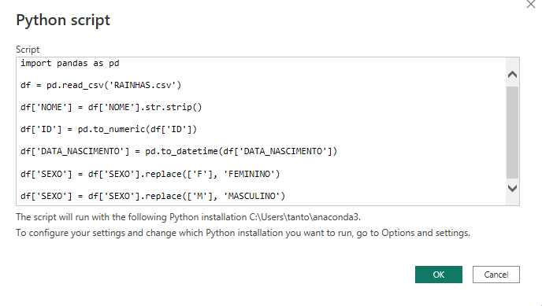

# Exercício de Pandas:

## Tratando arquivo csv com biblioteca Pandas via Power BI

### 1. Importação da biblioteca e leitura do arquivo de dados:

---

```python
import pandas as pddf = pd.read_csv('RAINHAS.csv')
```

### 2. Limpando espaços em branco desnecessários:

---

```python
df['NOME'] = df['NOME'].str.strip()
```

### 3. Transformando dados em texto da coluna para numérico:

```python
df['ID'] = pd.to_numeric(df['ID'])
```


### 4. Transformando dados em texto da coluna para data:

---

```python
df['DATA_NASCIMENTO'] = pd.to_datetime(df['DATA_NASCIMENTO'])
```

### 5. Executar o código no Script Python do Power BI:

---

```python
import pandas as pddf = pd.read_csv('RAINHAS.csv')df['NOME'] = df['NOME'].str.strip()df['ID'] = pd.to_numeric(df['ID'])df['DATA_NASCIMENTO'] = pd.to_datetime(df['DATA_NASCIMENTO'])
```

##### Imagem do código inserido no script python do Power BI:



---

##### Imagem da tabela no Power Query:


---

##### Imagem final da tabela no Power BI


---
